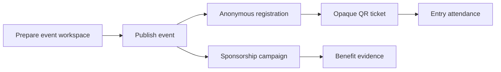

<div align="center">


# PartnerHub

### Event operations and sponsorship accountability, in progress

One workspace for preparing an event, issuing anonymous QR tickets, recording entry attendance, and tracking sponsor benefits.

[Product requirements](./PRD.md) · [Architecture](./ARCHITECTURE.md) · [Architecture essentials](./ARCHITECTURE-ESSETIALS.md)

</div>

## Overview

PartnerHub is a focused event operations product for campus organizations, youth communities, and small event teams. The product foundation is implemented as a typed Next.js scaffold. Event workflows, database-backed mutations, QR generation, and deployment remain **In progress**.

Current product boundaries are deliberate:

- Anonymous tickets, no personal-name prompt or personal account flow.
- Entry attendance only, with duplicate scan protection designed into schema.
- Sponsorship evidence as a core workflow.
- No payments, file uploads, chat, notifications, marketplace, or generic form builder in MVP.

## Product flow



Implementation for this flow is **In progress**. Full scope and acceptance criteria live in [PRD.md](./PRD.md).

## Current foundation

- Next.js 16 App Router scaffold with TypeScript and Tailwind CSS.
- Public foundation page and `GET /api/health` route.
- PostgreSQL and Prisma data model for events, anonymous registrations, attendance, campaigns, prospects, benefits, and timeline entries.
- Feature boundaries for event, registration, attendance, and sponsorship work.
- Product, architecture, and concise architecture-reference documents.

## Technology

| Area | Tools |
| --- | --- |
| Interface and server routes | Next.js 16, React 19, TypeScript |
| Styling | Tailwind CSS 4 |
| Validation | Zod |
| Database and migrations | PostgreSQL, Prisma |
| Quality checks | TypeScript, ESLint, Next.js build |

## Repository structure

```text
PartnerHub/
├── PRD.md
├── ARCHITECTURE.md
├── ARCHITECTURE-ESSETIALS.md
├── AGENTS.md
├── prisma/
│   └── schema.prisma
├── src/
│   ├── app/
│   │   ├── api/health/route.ts
│   │   ├── globals.css
│   │   ├── layout.tsx
│   │   └── page.tsx
│   ├── features/
│   │   ├── attendance/
│   │   ├── event/
│   │   ├── registration/
│   │   └── sponsorship/
│   └── lib/
└── tests/
```

## Run locally

```bash
npm install
npm run dev
```

Open `http://localhost:3000`.

Database-backed work is **In progress**. Before running Prisma migrations, copy `.env.example` to `.env` and provide a PostgreSQL `DATABASE_URL` plus both secret peppers.

```bash
npm run db:generate
npm run db:migrate
```

## Validation

Current scaffold passes:

```bash
npm run db:generate
npm run typecheck
npm run lint
npm run build
```

Feature-level unit, integration, and end-to-end tests are **In progress**. Planned coverage is documented in [ARCHITECTURE.md](./ARCHITECTURE.md).

## Risks and decisions

Capacity races, repeat scans, QR replay, secret leakage, time windows, and unavailable evidence links are documented with their planned safeguards in [PRD.md](./PRD.md) and [ARCHITECTURE.md](./ARCHITECTURE.md).

## License

License decision is **In progress**. No external dataset, API, model, or third-party code is included in this repository.
