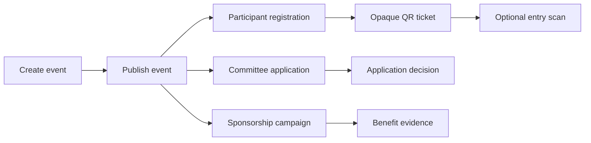

<div align="center">


# PartnerHub

### Event operations with sponsorship accountability

One workspace for event setup, reusable registration, committee recruitment, QR attendance, and sponsor benefit tracking.

[Product requirements](./PRD.md) · [Architecture](./ARCHITECTURE.md) · [Architecture essentials](./ARCHITECTURE-ESSETIALS.md) · [Venture concept](./Venture_Creation-2.md)

</div>

## Overview

PartnerHub is a Venture Creation concept for campus organizations, youth communities, and small event organizers that run recurring events. It aims to replace a fragmented mix of forms, spreadsheets, chat groups, ticket tools, and sponsorship files with one connected workspace.

The sponsorship workflow is the main differentiator. PartnerHub is not positioned as a national ticket marketplace, payment processor, generic CRM, or full HR system.

The repository currently contains a typed Next.js foundation and the earlier anonymous-registration Prisma model. Reusable accounts, committee recruitment, event workflows, database-backed mutations, QR generation, and deployment remain **In progress**.

## Planned first-version flow



The first version is intended to demonstrate one complete event flow at a Venture Creation booth. Full scope and acceptance criteria live in [PRD.md](./PRD.md).

## Product boundaries

- Reusable profile data requires account-holder consent.
- Roles are event-specific. An account does not have one permanent participant, committee, or organizer type.
- QR payloads contain an opaque ticket reference and secret, never personal data.
- Attendance can be disabled or use entry-only scanning in the first version.
- Sponsorship uses proposal and evidence URLs. File uploads are deferred.
- Payments, exit scans, committee task boards, chat, sponsor matching, automatic matching notifications, and marketplace behavior are deferred.

## Current foundation

- Next.js 16 App Router scaffold with TypeScript and Tailwind CSS.
- Public foundation page and `GET /api/health` route.
- PostgreSQL and Prisma model for events, anonymous registrations, attendance, sponsorship campaigns, prospects, benefits, and timeline entries.
- Feature boundaries for event, registration, attendance, and sponsorship work.
- Product, architecture, and Venture Creation working documents.

The current schema does not yet implement reusable accounts or committee recruitment. Those changes are **In progress** and must not be treated as completed features.

## Technology

| Area | Tools |
| --- | --- |
| Interface and server routes | Next.js 16, React 19, TypeScript |
| Styling | Tailwind CSS 4 |
| Validation | Zod |
| Database and migrations | PostgreSQL, Prisma |
| Quality checks | TypeScript, ESLint, Next.js build |
| Authentication | **In progress** |

## Repository structure

```text
PartnerHub/
├── Venture_Creation-2.md
├── Venture_Creation-3.md
├── Venture_Creation-4.md
├── PRD.md
├── ARCHITECTURE.md
├── ARCHITECTURE-ESSETIALS.md
├── AGENTS.md
├── prisma/
│   └── schema.prisma
├── src/
│   ├── app/
│   ├── features/
│   │   ├── attendance/
│   │   ├── event/
│   │   ├── registration/
│   │   └── sponsorship/
│   └── lib/
└── tests/
```

## Run locally

```bash
npm install
npm run dev
```

Open `http://localhost:3000`.

Database-backed work is **In progress**. Before running Prisma migrations, copy `.env.example` to `.env` and provide a PostgreSQL `DATABASE_URL` plus the current secret peppers.

```bash
npm run db:generate
npm run db:migrate
```

## Validation status

The expanded event-operations concept has not yet been validated through owned interviews, usability tests, paid usage, or revenue. Planned research includes organizer interviews, participant registration tests, committee application review, a small QR check-in test, and sponsorship workflow feedback.

The current scaffold has previously passed:

```bash
npm run db:generate
npm run typecheck
npm run lint
npm run build
```

Documentation changes in this revision do not prove the planned product features. Feature-level unit, integration, and end-to-end tests remain **In progress**.

## Source documents

- [Business concept and first-version scope](./Venture_Creation-2.md)
- [Opportunity assessment](./Venture_Creation-3.md)
- [Key idea, product, and market](./Venture_Creation-4.md)

The public LOKET creator page cited in the Venture document is competitor and market context only. It is not evidence of PartnerHub demand, traction, or revenue.

## License

License decision is **In progress**. No external dataset, API, model, or third-party source code is included in this repository.
